# Manual de Usuario — Sistema de Acreditación y Educación Continua (SAEC)

**Universidad Politécnica de Texcoco (UPTex)**
Plataforma institucional construida sobre Moodle 4.4, tema `theme_saec`.

---

## Presentación Institucional

### ¿Qué es SAEC?

El **Sistema de Acreditación y Educación Continua (SAEC)** es la plataforma digital de UPTex para la gestión académica y la emisión de credenciales verificables. No es un Moodle genérico: cada pantalla que usted visita fue rediseñada específicamente para tres tipos de usuario — **Alumno**, **Docente** y **Administrador** — de modo que cada uno vea únicamente la información y las herramientas relevantes para su rol, con un lenguaje visual (colores, íconos, tarjetas) consistente en toda la plataforma.

### Arquitectura de roles

SAEC reconoce automáticamente el rol de la persona que inicia sesión y le presenta un **Panel Principal** distinto:

| Rol | Enfoque de su Panel Principal |
|---|---|
| **Alumno** | Su progreso académico personal: calificaciones, asistencia, tareas por entregar e insignias obtenidas. |
| **Docente** | La operación diaria de sus grupos: próxima clase, entregas por calificar, creación rápida de tareas y avisos. |
| **Administrador** | La salud del sistema completo: usuarios activos, cursos, insignias emitidas y accesos directos de gestión. |

No existe una cuarta variante "genérica" — si usted no ve las pantallas descritas en este manual para su rol, contacte al Administrador del Sistema para verificar que su cuenta tenga el rol correcto asignado.

### Tecnología de microcredenciales

Cada curso o programa puede emitir **insignias digitales** (Open Badges v2.0, compatibles con Credly y LinkedIn) que funcionan como certificados verificables: cada una lleva un **hash de verificación único** que cualquier tercero puede consultar públicamente para confirmar su autenticidad, sin depender de que UPTex confirme manualmente cada credencial.

### Cómo usar este manual

Cada capítulo corresponde a un rol. Dentro de cada capítulo, cada sección documenta **una pantalla real de la plataforma**, con una captura de pantalla auténtica (no ilustrativa), la lista completa de sus controles, los pasos para usarla y qué ocurre exactamente al presionar cada botón. Si usted tiene más de un rol (por ejemplo, es Docente y también está inscrito como Alumno en un curso de capacitación), consulte el capítulo correspondiente a la tarea que quiere realizar.

---

## Índice

- [Capítulo 1 — Portal Público y Acceso](#capítulo-1--portal-público-y-acceso)
  - [1.1 Portada Institucional](#11-portada-institucional)
  - [1.2 Inicio de Sesión](#12-inicio-de-sesión)
  - [1.3 Recuperación de Contraseña](#13-recuperación-de-contraseña)
- [Capítulo 2 — Módulo del Alumno](#capítulo-2--módulo-del-alumno)
  - [2.1 Panel Principal](#21-panel-principal)
  - [2.2 Mis Cursos](#22-mis-cursos)
  - [2.3 Mis Tareas](#23-mis-tareas)
  - [2.4 Mi Rendimiento Académico (Boleta Digital)](#24-mi-rendimiento-académico-boleta-digital)
  - [2.5 Mi Mochila de Insignias](#25-mi-mochila-de-insignias)
  - [2.6 Preferencias de Cuenta](#26-preferencias-de-cuenta)
  - [2.7 Mensajería (función compartida)](#27-mensajería-función-compartida)
- [Capítulo 3 — Módulo del Docente](#capítulo-3--módulo-del-docente)
  - [3.1 Panel Principal](#31-panel-principal)
  - [3.2 Mis Cursos](#32-mis-cursos)
  - [3.3 Estudiantes y Progreso](#33-estudiantes-y-progreso)
  - [3.4 Calificador Integral](#34-calificador-integral)
  - [3.5 Control de Asistencia](#35-control-de-asistencia)
  - [3.6 Edición de Curso](#36-edición-de-curso)
- [Capítulo 4 — Módulo del Administrador](#capítulo-4--módulo-del-administrador)
  - [4.1 Panel Principal](#41-panel-principal)
  - [4.2 Catálogo Global de Cursos](#42-catálogo-global-de-cursos)
  - [4.3 Directorio de Usuarios](#43-directorio-de-usuarios)
  - [4.4 Reportes y Auditoría](#44-reportes-y-auditoría)
  - [4.5 Centro de Administración del Sitio](#45-centro-de-administración-del-sitio)
  - [4.6 Preferencias de Cuenta](#46-preferencias-de-cuenta)
- [Capítulo 5 — Glosario y Preguntas Frecuentes](#capítulo-5--glosario-y-preguntas-frecuentes)

---

## Capítulo 1 — Portal Público y Acceso

Este capítulo cubre las tres pantallas visibles para cualquier persona **sin sesión iniciada**.

### 1.1 Portada Institucional

**Ruta:** `/`

**Para qué sirve:** es la puerta de entrada pública de SAEC — presenta la marca institucional, permite explorar el catálogo de cursos reales sin necesidad de una cuenta, y dirige al inicio de sesión.

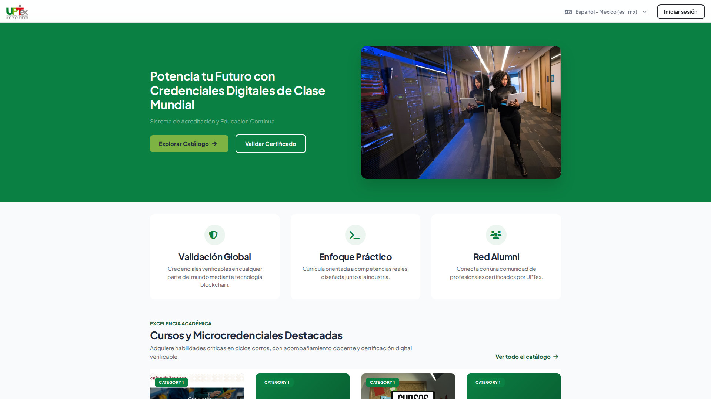

**Elementos de la pantalla:**

| Elemento | Descripción |
|---|---|
| Barra de navegación | Logo (regresa a la portada), selector de idioma, botón **Iniciar sesión**. |
| Sección principal (Hero) | Título institucional, botón **Explorar Catálogo** y botón **Validar Certificado**. |
| Tarjetas de valor | Tres tarjetas: *Validación Global*, *Enfoque Práctico*, *Red Alumni*. |
| Cursos destacados | Cuadrícula de cursos reales tomados directamente de la base de datos — nunca contenido de ejemplo. |
| Banner de acreditación | Cuatro tarjetas institucionales: *Open Badges v2.0*, *Modelo por Competencias*, *Acreditación Oficial*, *Rutas Formativas*. |
| Pie de página | Logotipos institucionales y aviso de derechos reservados. |

**Pasos para usarla:**

1. Ingrese a la dirección del sitio en su navegador.
2. Lea el mensaje principal y, si desea ver los cursos disponibles, presione **Explorar Catálogo** (lo lleva a la sección de cursos destacados de esta misma página).
3. Desplácese hacia abajo para conocer las tarjetas de valor y el banner de acreditación.
4. Cuando esté listo para acceder a su cuenta, presione **Iniciar sesión** en la barra de navegación.

> **Nota práctica:** el botón **Validar Certificado** no abre una herramienta de verificación independiente — actualmente enlaza a la misma pantalla de inicio de sesión. Si necesita verificar una insignia específica emitida a un alumno, use el enlace **"Verificar insignia"** que aparece dentro del detalle de cada credencial (ver sección [2.5](#25-mi-mochila-de-insignias)), que sí es una página pública de verificación independiente.

---

### 1.2 Inicio de Sesión

**Ruta:** `/login/index.php`

**Para qué sirve:** autenticar a cualquier usuario ya registrado (Alumno, Docente o Administrador) mediante su usuario y contraseña institucionales.

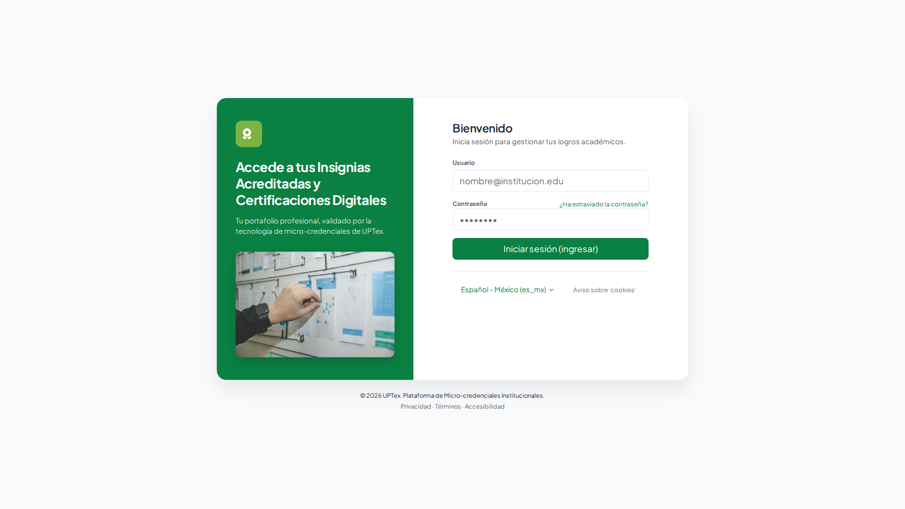

**Elementos de la pantalla:**

| Elemento | Descripción |
|---|---|
| Panel institucional | Imagen y mensaje de bienvenida (visible solo en pantallas amplias). |
| Campo **Usuario** | Acepta el nombre de usuario o correo institucional. |
| Campo **Contraseña** | Con ícono para mostrar/ocultar el texto ingresado. |
| Enlace **¿Olvidó su contraseña?** | Lleva directamente a la tarjeta de soporte institucional (sección [1.3](#13-recuperación-de-contraseña)). |
| Botón **Iniciar sesión** | Envía el formulario. |
| Selector de idioma y enlace de cookies | En la parte inferior del formulario. |

**Pasos para iniciar sesión:**

1. Escriba su nombre de usuario o correo institucional en el campo **Usuario**.
2. Escriba su contraseña en el campo **Contraseña**. Puede presionar el ícono de ojo para verificar que la escribió correctamente.
3. Presione **Iniciar sesión**.
4. Si sus datos son correctos, será dirigido automáticamente a **su Panel Principal** (`/my/`), el cual variará según su rol — vea el capítulo correspondiente.
5. Si aparece un mensaje de error, verifique que no tenga el bloqueo de mayúsculas activado y vuelva a intentarlo. Si el problema persiste, siga el procedimiento de la sección [1.3](#13-recuperación-de-contraseña).

> **Importante:** los tres enlaces legales del pie de este formulario (*Privacidad*, *Términos*, *Accesibilidad*) todavía no tienen una página de destino publicada — es un elemento pendiente de contenido institucional, no un error de su navegador.

---

### 1.3 Recuperación de Contraseña

**Ruta:** `/theme/saec/pages/forgot_password.php`

**Para qué sirve:** SAEC **no restablece contraseñas de forma automática por correo electrónico** — esta pantalla reemplaza por completo ese flujo con instrucciones claras de a quién contactar, siguiendo la política institucional de seguridad de UPTex.

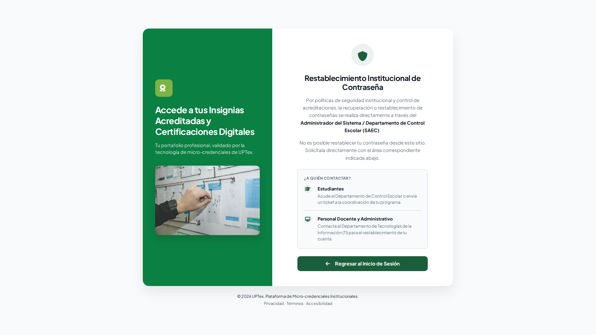

**Elementos de la pantalla:**

| Elemento | Descripción |
|---|---|
| Mensaje principal | Explica que el restablecimiento se gestiona directamente por el Administrador del Sistema / Control Escolar. |
| Sección "¿A quién contactar?" | Dos canales de contacto diferenciados (ver tabla siguiente). |
| Botón **Regresar al Inicio de Sesión** | Único control interactivo de la página. |

**¿A quién debo contactar?**

| Si usted es... | Debe acudir a... |
|---|---|
| **Estudiante** | El Departamento de Control Escolar, o enviar un ticket a la coordinación de su programa. |
| **Personal Docente o Administrativo** | El Departamento de Tecnologías de la Información (TI). |

**Procedimiento:**

1. Desde el formulario de login, presione **¿Olvidó su contraseña?**.
2. Lea la tarjeta y ubique el canal correspondiente a su perfil en la tabla anterior.
3. Realice la solicitud de restablecimiento **fuera de la plataforma**, por el canal indicado — esta página no envía ningún correo ni procesa ninguna solicitud por sí misma.
4. Una vez que el área correspondiente le proporcione una nueva contraseña, presione **Regresar al Inicio de Sesión** y acceda normalmente.

---

## Capítulo 2 — Módulo del Alumno

*Usuario de referencia: `alumno_top1`.*

### 2.1 Panel Principal

**Ruta:** `/my/`

**Para qué sirve:** es lo primero que un Alumno ve al iniciar sesión — un resumen de su situación académica actual y un acceso directo a lo que más usa.

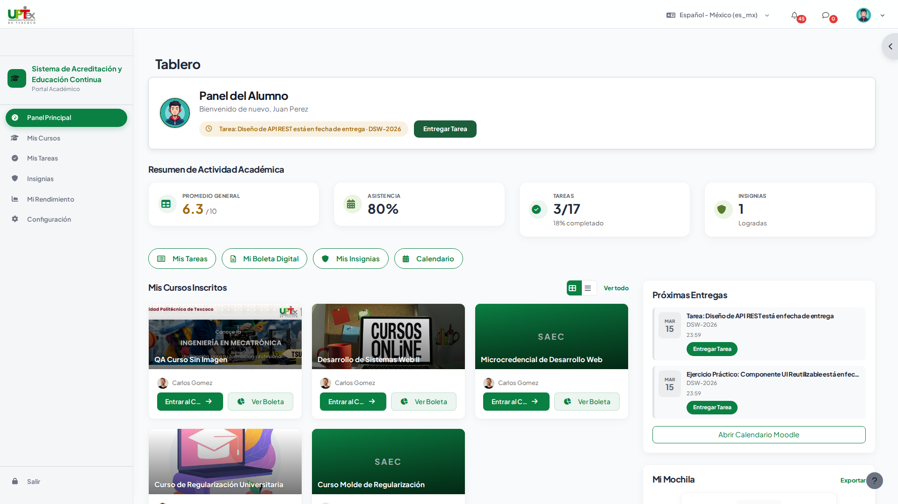

**Elementos de la pantalla:**

| Zona | Contenido |
|---|---|
| Encabezado (Hero) | Su fotografía o avatar, saludo con su nombre, y un aviso dinámico: si tiene una entrega próxima, muestra su nombre y materia con el botón **Entregar Tarea**; si no tiene pendientes, muestra un mensaje de felicitación. |
| Resumen de Actividad Académica | Cuatro indicadores: **Promedio General** (escala 0–10), **Asistencia** (%), **Tareas** (completadas/total), **Insignias** (obtenidas). |
| Accesos rápidos | Botones: **Mis Tareas**, **Mi Boleta Digital**, **Mis Insignias**, **Calendario**. |
| Mis Cursos Inscritos | Tarjetas de sus cursos activos, con imagen, docente titular, barra de avance y botones **Entrar al Curso** / **Ver Boleta**. |
| Próximas Entregas | Lista de sus próximas tareas con fecha, y botón **Entregar Tarea** en cada una. |
| Mi Mochila | Vista previa de sus insignias más recientes. |

**Cómo usar su Panel Principal — paso a paso:**

1. Al iniciar sesión, revise primero el encabezado: si hay un aviso de entrega urgente, decida si actuar de inmediato con el botón **Entregar Tarea**.
2. Revise sus cuatro indicadores para tener una idea rápida de su desempeño general.
3. Si necesita algo específico, use los botones de acceso rápido en vez de buscar manualmente.
4. Para entrar a un curso, localice su tarjeta en "Mis Cursos Inscritos" y presione **Entrar al Curso**.
5. Revise el panel "Próximas Entregas" al menos una vez al día para no perder ninguna fecha límite.

> **Tip:** puede alternar entre vista de cuadrícula y vista de lista en la sección "Mis Cursos Inscritos" usando los dos íconos junto al encabezado — su preferencia se recuerda automáticamente en su navegador.

---

### 2.2 Mis Cursos

**Ruta:** `/my/courses.php`

**Para qué sirve:** ver **todos** sus cursos organizados por su progreso real de avance, no solo los más recientes, e inscribirse por su cuenta en cursos que lo permitan.

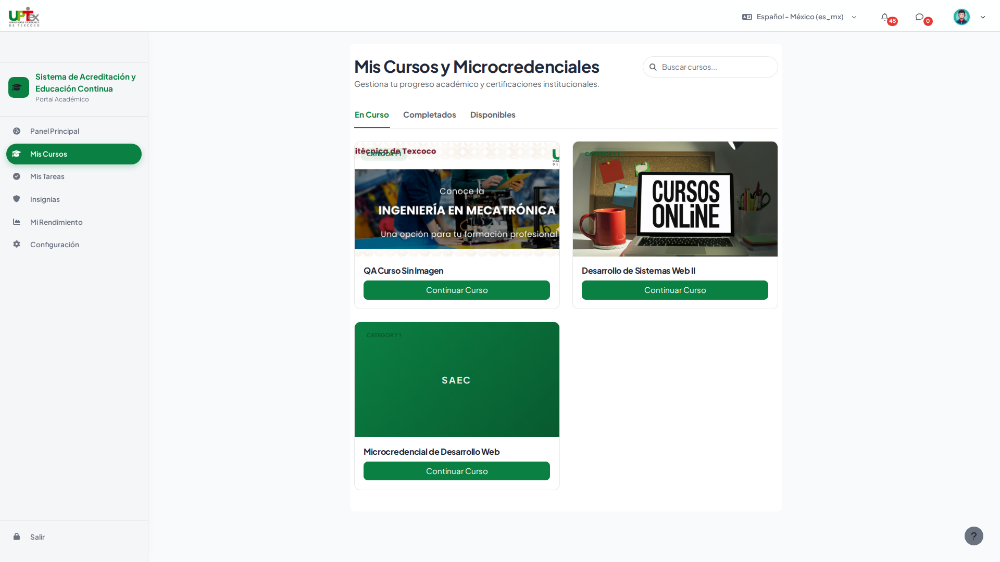

**Elementos de la pantalla:**

| Elemento | Descripción |
|---|---|
| Buscador | Filtra las tarjetas de curso por nombre en tiempo real. |
| Pestaña **En Progreso** | Cursos donde tiene avance registrado pero aún no ha terminado. Muestra barra de progreso y botón **Continuar Curso**. |
| Pestaña **Completados** | Cursos ya finalizados al 100%. Muestra botón **Ver Insignia**. |
| Pestaña **Disponibles** | Cursos abiertos a autoinscripción. Muestra botón **Inscribirme Ahora**. |

**Pasos para usar esta pantalla:**

1. Elija la pestaña correspondiente a lo que busca.
2. Si tiene muchos cursos, escriba parte del nombre en el buscador para encontrarlo más rápido.
3. En **En Progreso**, presione **Continuar Curso** para retomar exactamente donde lo dejó.
4. En **Completados**, presione **Ver Insignia** para ir directo a su credencial de ese curso.
5. En **Disponibles**, presione **Inscribirme Ahora** — será dirigido al asistente de inscripción; siga sus instrucciones en pantalla para confirmar.

---

### 2.3 Mis Tareas

**Ruta:** `/theme/saec/pages/student_tasks.php`

**Para qué sirve:** consultar **todas** sus tareas de **todos** sus cursos en una sola lista, sin tener que entrar curso por curso.

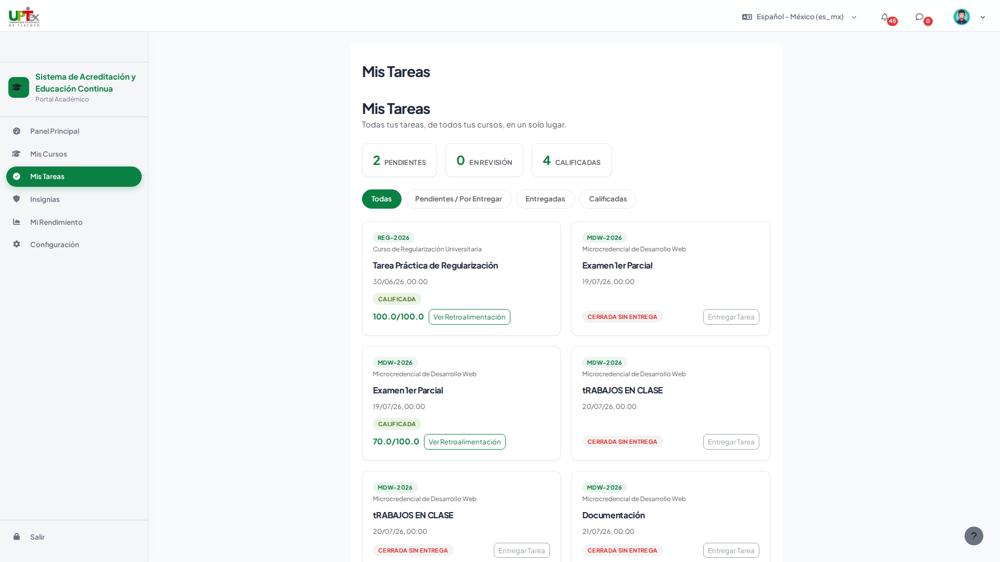

**Elementos de la pantalla:**

| Elemento | Descripción |
|---|---|
| Indicadores rápidos | **Pendientes**, **En Revisión**, **Calificadas**. |
| Filtros | **Todas**, **Pendientes / Por Entregar**, **Entregadas**, **Calificadas**. |
| Tarjeta de tarea | Curso, título, fecha límite, urgencia (**Urgente** / **Próximo** / **Con Tiempo**) y estado. |

**Cómo interpretar el estado de una tarea:**

| Estado | Significado | Botón disponible |
|---|---|---|
| **Pendiente** | Aún no la ha entregado. | **Entregar Tarea** |
| **Entregada** | Ya la envió, en espera de calificación. | **Ver Entrega** |
| **Calificada** | Ya tiene una nota asignada. | **Ver Retroalimentación** |
| **Cerrada sin entrega** | El plazo venció sin que usted entregara. | Ninguno (ya no es posible entregar). |

**Pasos para entregar una tarea:**

1. Ubique la tarea en la lista (use los filtros si tiene muchas).
2. Presione **Entregar Tarea** — será llevado a la pantalla nativa de Moodle donde puede escribir texto y/o adjuntar archivos.
3. Complete su entrega y confirme el envío desde esa pantalla.
4. Regrese a "Mis Tareas": el estado de esa tarea cambiará a **Entregada**.

---

### 2.4 Mi Rendimiento Académico (Boleta Digital)

**Ruta:** `/grade/report/overview/index.php`

**Para qué sirve:** ofrecer una vista analítica de su desempeño general: promedio, avance, tendencia y un desglose por materia — es la "boleta digital" de SAEC.

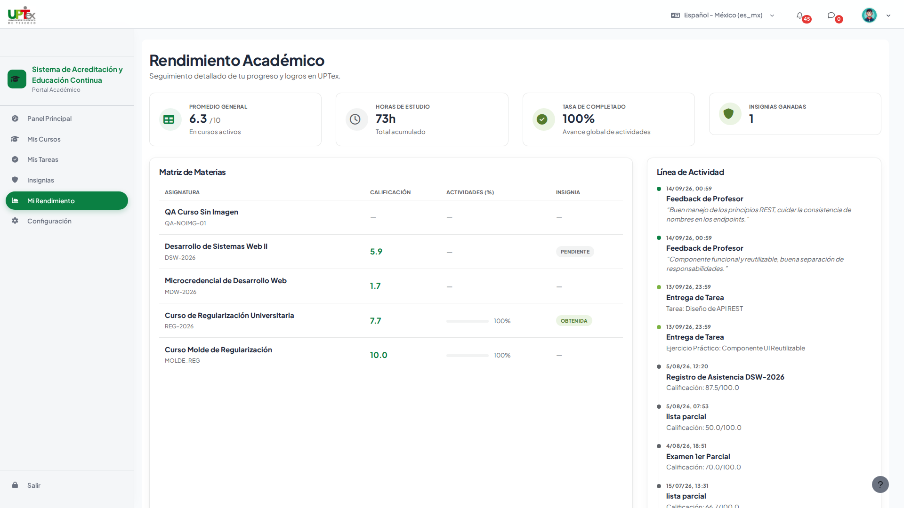

**Elementos de la pantalla:**

| Elemento | Descripción |
|---|---|
| Indicadores | **Promedio General**, **Horas de Estudio**, **Tasa de Finalización**, **Insignias Obtenidas**. |
| Matriz de Materias | Tabla con su calificación y progreso por cada curso inscrito. |
| Línea de Tiempo | Hasta 8 eventos recientes: retroalimentación recibida, calificación registrada o entrega realizada. |
| Próximo Hito | El curso más cercano a completarse. |
| Tarjeta de Tendencia | Compara su promedio del mes anterior contra el actual. |
| Tarjeta de Estatus | Clasificación general: *Sobresaliente*, *Bueno*, *Aprobando*, *En Riesgo* o *Sin Datos*. |

**Cómo leer esta pantalla:**

1. Revise su **Promedio General** y su **Tarjeta de Estatus** para un diagnóstico inmediato.
2. Consulte la **Matriz de Materias** para identificar en qué curso específico necesita reforzar su desempeño.
3. Use la **Línea de Tiempo** para recordar qué actividad reciente afectó su calificación.
4. Si su tarjeta de tendencia muestra una flecha hacia abajo, considere contactar a su docente antes de que su estatus cambie a "En Riesgo".

> Esta pantalla es de **solo consulta** — no existen botones de edición; toda acción de calificación ocurre del lado del docente.

---

### 2.5 Mi Mochila de Insignias

**Ruta:** `/badges/mybadges.php`

**Para qué sirve:** es su portafolio digital de credenciales — todas las insignias que ha obtenido, más las que están en camino de obtener.

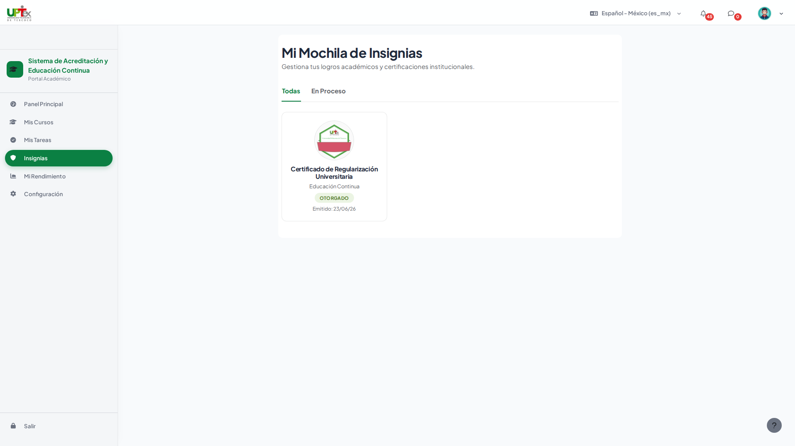

**Elementos de la pantalla:**

| Elemento | Descripción |
|---|---|
| Pestaña **Todas** | Insignias ya emitidas a su nombre. |
| Pestaña **En Proceso** | Insignias asociadas a un curso que aún está cursando. |
| Tarjeta de insignia | Toda la tarjeta es clicable — al presionarla se abre el detalle completo. |

**Contenido del modal de detalle:**

- Imagen de la insignia en tamaño completo.
- Emisor y fecha de expiración (si aplica).
- **Hash de verificación único** — un código que identifica de forma inequívoca esa credencial.
- Enlace **Verificar insignia** — abre la página pública de verificación en una pestaña nueva, donde cualquier persona (por ejemplo, un reclutador) puede confirmar la autenticidad sin iniciar sesión.
- Descripción y **Criterios de Obtención**.
- Botones **Descargar Insignia** y **Añadir a LinkedIn** (para insignias ya obtenidas).

**Pasos para compartir una insignia:**

1. Entre a "Mis Insignias" desde el Panel Principal o el menú lateral.
2. Localice la insignia en la pestaña **Todas** y presione sobre su tarjeta.
3. En el modal, presione **Añadir a LinkedIn** para publicarla directamente en su perfil profesional, o **Descargar Insignia** para guardar el archivo verificable en su computadora.
4. Si necesita compartir el enlace de verificación con un tercero, use **Verificar insignia** y copie la dirección que se abre.

---

### 2.6 Preferencias de Cuenta

**Ruta:** `/user/preferences.php`

**Para qué sirve:** administrar su información personal, contraseña y notificaciones desde un solo lugar.

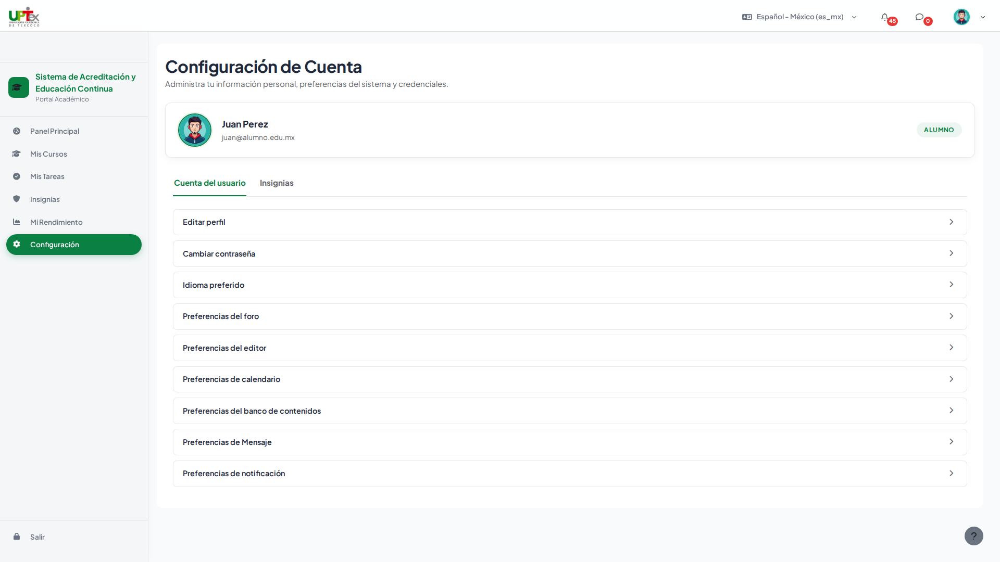

**Elementos de la pantalla:**

| Elemento | Descripción |
|---|---|
| Encabezado | Su fotografía, nombre completo, correo y etiqueta de rol. |
| Pestañas de categoría | Agrupan las opciones nativas de Moodle (cuenta, notificaciones, insignias, entre otras) en pestañas horizontales. |
| Enlaces de cada pestaña | Cada uno lo lleva al formulario real correspondiente (por ejemplo, cambio de contraseña). |

**Pasos para cambiar su contraseña:**

1. Entre a "Preferencias" desde el menú de su usuario (esquina superior derecha) o desde el menú lateral.
2. Ubique la pestaña de cuenta y presione el enlace de cambio de contraseña.
3. Complete el formulario nativo de Moodle con su contraseña actual y la nueva.
4. Guarde los cambios.

---

### 2.7 Mensajería (función compartida)

La mensajería **no es una página independiente** — es un panel que puede abrir desde **cualquier pantalla** de la plataforma, disponible para los tres roles.

**Cómo usarla:**

1. Localice el ícono de burbuja de chat en la barra superior (junto al de notificaciones). Un número en rojo indica mensajes sin leer.
2. Presione el ícono — un panel se desliza desde el borde derecho de la pantalla.
3. Use el buscador interno para localizar a la persona con quien desea comunicarse, o seleccione una conversación reciente de la lista.
4. Escriba su mensaje en el campo de texto y envíelo — la conversación se actualiza sin recargar la página.

---

## Capítulo 3 — Módulo del Docente

*Usuario de referencia: `maestro_b1`.*

### 3.1 Panel Principal

**Ruta:** `/my/`

**Para qué sirve:** ofrecer al Docente una vista operativa diaria de sus grupos, con atajos para las acciones que realiza con más frecuencia.

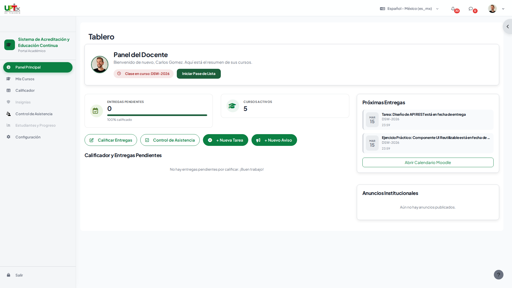

**Elementos de la pantalla:**

| Zona | Contenido |
|---|---|
| Encabezado (Hero) | Su fotografía, saludo, y un aviso dinámico de su **próxima clase de asistencia** (o "sin clases programadas" si no hay ninguna cercana), con el botón **Iniciar Pase de Lista** cuando corresponde. |
| Indicadores | **Entregas Pendientes** (con barra de eficiencia de calificación) y **Cursos Activos**. |
| Accesos rápidos | **Calificar Entregas**, **Control de Asistencia**, **+ Nueva Tarea**, **+ Nuevo Aviso**. |
| Calificador y Entregas Pendientes | Tabla de las entregas más antiguas sin calificar, con botón directo **Calificar** por fila. |
| Próximas Entregas | Fechas límite próximas en todos sus cursos. |
| Anuncios Institucionales | Avisos publicados a nivel de todo el sitio. |

**Cómo usar su Panel Principal — paso a paso:**

1. Revise el encabezado: si tiene una clase próxima o en curso, decida si presionar **Iniciar Pase de Lista** de inmediato.
2. Revise "Calificador y Entregas Pendientes" — es la lista priorizada de lo que debe calificar primero (las entregas más antiguas aparecen arriba).
3. Para crear contenido rápidamente sin navegar manualmente a un curso, use **+ Nueva Tarea** o **+ Nuevo Aviso**.

**Cómo crear una tarea nueva desde el Panel Principal:**

1. Presione **+ Nueva Tarea**.
2. En la ventana que se abre, seleccione el curso donde desea crear la tarea.
3. Será llevado directamente al formulario de creación de tareas de ese curso — complete los datos y guarde normalmente.

**Cómo publicar un aviso desde el Panel Principal:**

1. Presione **+ Nuevo Aviso**.
2. Seleccione el curso cuyo foro de anuncios desea usar.
3. Complete y publique el aviso en el editor nativo que se abre.

---

### 3.2 Mis Cursos

**Ruta:** `/my/courses.php`

**Para qué sirve:** administrar el catálogo de cursos que imparte: buscarlos, controlar su visibilidad para los alumnos y acceder a herramientas de configuración.

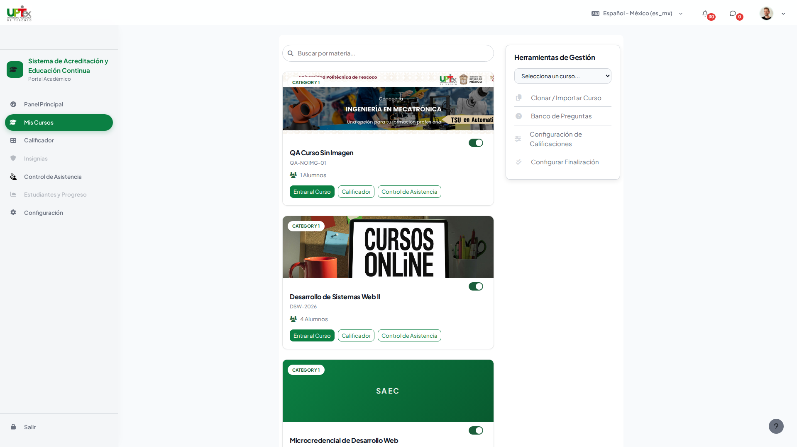

**Elementos de la pantalla:**

| Elemento | Descripción |
|---|---|
| Buscador y filtro de periodo | Localizan cursos por nombre o por año. |
| Tarjeta de curso | Incluye un **interruptor de visibilidad**, conteo real de alumnos activos, y botones **Entrar al curso**, **Calificador**, **Asistencia**. |
| Panel "Herramientas de Gestión" | Selector de curso + accesos a Importar, Banco de Preguntas, Configuración de Calificaciones y Configuración de Finalización. |

**Pasos para ocultar o mostrar un curso a sus alumnos:**

1. Localice la tarjeta del curso.
2. Presione el interruptor de visibilidad — el cambio se guarda automáticamente, sin necesidad de recargar la página.
3. Si el interruptor regresa solo a su posición anterior, significa que el cambio no se guardó (verifique su conexión e inténtelo de nuevo).

**Pasos para usar las Herramientas de Gestión:**

1. En el panel derecho, seleccione el curso deseado en el selector.
2. Los cuatro enlaces (Importar, Banco de Preguntas, etc.) se activan automáticamente con la URL correcta de ese curso.
3. Presione el enlace de la herramienta que necesita.

---

### 3.3 Estudiantes y Progreso

**Ruta:** `/grade/report/user/index.php`

**Para qué sirve:** dar al Docente una vista analítica de cómo va su grupo completo en un curso específico, con detección automática de alumnos que necesitan atención.

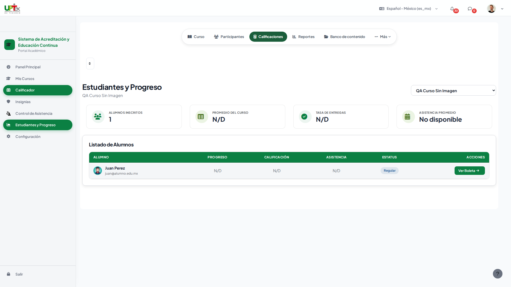

**Elementos de la pantalla:**

| Elemento | Descripción |
|---|---|
| Selector de curso | Visible si el docente imparte más de un curso. |
| Indicadores | **Alumnos Inscritos**, **Promedio del Curso**, **Tasa de Entregas**, **Asistencia Promedio**. |
| Alumnos en Riesgo | Aparece únicamente cuando hay al menos un alumno que cumple el criterio de riesgo. |
| Listado de Alumnos | Tabla completa con progreso, calificación, asistencia, estatus y botón **Ver Boleta**. |

**Criterio exacto de riesgo académico** (aplicado automáticamente por el sistema):

| Estatus | Condición |
|---|---|
| **En Riesgo** | Calificación menor a **7.0** *o* asistencia menor a **80%**. |
| **Acreditado** | No está en riesgo, y su calificación es de **8.0 o superior**. |
| **Regular** | Cualquier otro caso (no está en riesgo, pero su calificación aún no llega a 8.0). |

**Pasos para atender a un alumno en riesgo:**

1. Revise el widget **Alumnos en Riesgo** en cuanto entre a esta pantalla.
2. Identifique si la causa es la calificación, la asistencia, o ambas (se muestra junto al nombre del alumno).
3. Presione la tarjeta del alumno, o **Ver Boleta** en la tabla completa, para ver su desglose de calificaciones individual y decidir la intervención adecuada (tutoría, recordatorio, etc.).

---

### 3.4 Calificador Integral

**Rutas:** `/grade/report/grader/index.php` (matriz de captura) &middot; `/grade/edit/tree/index.php` (ponderaciones) &middot; `/grade/report/singleview/index.php` (vista única)

**Para qué sirve:** es el conjunto de herramientas donde el Docente captura y ajusta calificaciones. SAEC no reemplaza estas herramientas de Moodle — las hace más cómodas de usar visualmente.

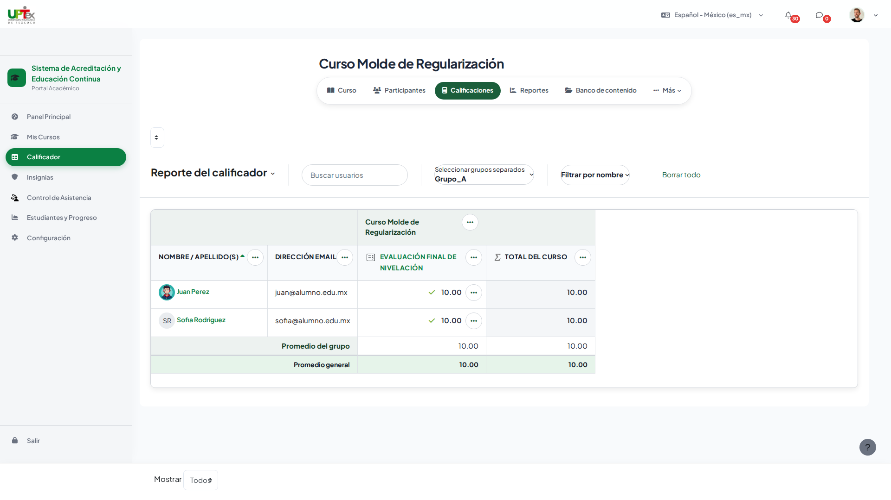

**Elementos de la pantalla:**

| Herramienta | Para qué sirve | Detalle visual de SAEC |
|---|---|---|
| **Calificador** | Captura de notas de todo el grupo en una sola matriz. | El encabezado y la columna de nombres permanecen **fijos** al desplazarse, para no perder de vista a qué alumno se está calificando. |
| **Configuración de Calificaciones** | Definir cómo se ponderan categorías y actividades. | Estructura en árbol con indentación clara por nivel. |
| **Vista Única** | Editar solo un alumno o solo una actividad. | Selector simple entre ambos modos. |

**Pasos para capturar calificaciones:**

1. Entre al Calificador desde **Calificar Entregas** en el Panel Principal, o desde la tarjeta de un curso.
2. Localice la celda del alumno y la actividad correspondiente.
3. Escriba la calificación directamente en la celda.
4. Guarde los cambios con el botón nativo de Moodle antes de salir de la pantalla.

> El guardado es responsabilidad del formulario nativo de Moodle — asegúrese siempre de presionar el botón de guardar antes de navegar a otra pantalla, de lo contrario perderá lo capturado.

---

### 3.5 Control de Asistencia

**Rutas:** `/theme/saec/pages/attendance_hub.php` (centro de control) &middot; `/mod/attendance/manage.php` (gestión de sesiones) &middot; `/mod/attendance/take.php` (toma de asistencia)

**Para qué sirve:** Moodle no ofrece de forma nativa una vista que reúna todas las actividades de asistencia de todos los cursos de un docente — SAEC sí la ofrece, en un solo lugar.

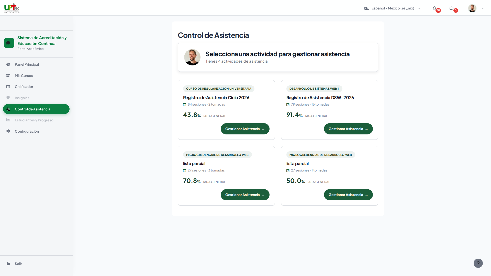

**Elementos de la pantalla:**

| Elemento | Descripción |
|---|---|
| Tarjeta de actividad de asistencia | Una por cada actividad de asistencia que el docente tiene en sus cursos, con su tasa real de asistencia y botón **Gestionar Asistencia**. |
| Tabla de sesiones (al gestionar) | Marca cada sesión como **Tomada** o **Pendiente**. |
| Pantalla de toma de asistencia | Un control por alumno con cuatro opciones. |

**Códigos de estado de asistencia:**

| Código | Significado |
|---|---|
| **P** | Presente |
| **L** | Llegó tarde (retardo) |
| **E** | Ausencia justificada |
| **A** | Ausente |

**Pasos para tomar asistencia en una clase:**

1. Entre al Centro de Asistencia desde **Control de Asistencia** en el Panel Principal.
2. Localice la actividad correspondiente y presione **Gestionar Asistencia**.
3. En la tabla de sesiones, ubique la sesión marcada como **Pendiente** (normalmente la de hoy) y ábrala.
4. Marque **P**, **L**, **E** o **A** para cada alumno. Si la mayoría del grupo está presente, use el botón **Marcar Todos Presente** y después corrija manualmente las excepciones.
5. Presione el botón de envío al final del formulario para **guardar** — marcar las opciones por sí solo no guarda nada todavía.

---

### 3.6 Edición de Curso

**Ruta:** `/course/view.php`

**Para qué sirve:** ver y modificar el contenido de un curso — secciones, tareas, foros, materiales — con un encabezado que añade contexto que Moodle no muestra de forma nativa.

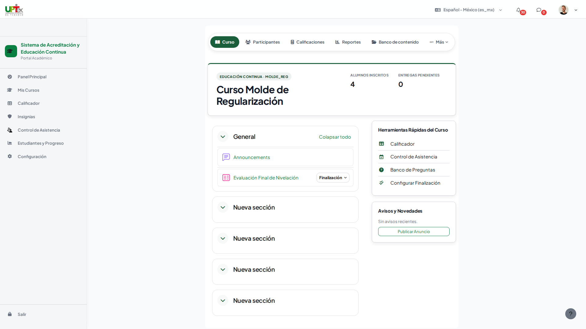

**Elementos de la pantalla:**

| Elemento | Descripción |
|---|---|
| Encabezado del curso | Categoría, clave del curso, número de alumnos y de entregas pendientes, y el botón **Activar edición**. |
| Barra lateral | Accesos rápidos (Calificador, Asistencia, Banco de Preguntas) y avisos del curso con botón **Publicar Aviso**. |
| Selector de actividades | Se abre al presionar "Añadir una actividad o recurso" en modo edición. |

**Pasos para añadir una actividad o recurso:**

1. Entre al curso y presione **Activar edición** en la esquina superior del encabezado.
2. Ubique la sección donde desea agregar contenido y presione **Añadir una actividad o recurso**.
3. En la ventana que se abre, use las pestañas (Todos / Actividades / Recursos) o el buscador interno para localizar el tipo que necesita (por ejemplo, "Tarea" o "Foro").
4. Presione la tarjeta del tipo elegido — Moodle abrirá el formulario de configuración de esa actividad.
5. Complete la configuración y guarde para que la actividad quede publicada en el curso.

---

## Capítulo 4 — Módulo del Administrador

*Usuario de referencia: `admin`.*

### 4.1 Panel Principal

**Ruta:** `/my/`

**Para qué sirve:** es el centro de mando ejecutivo diario del Administrador — el estado general del sistema y los atajos de gestión más usados, **sin** entrar a la configuración detallada del sitio (eso vive en un espacio separado, ver [4.5](#45-centro-de-administración-del-sitio)).

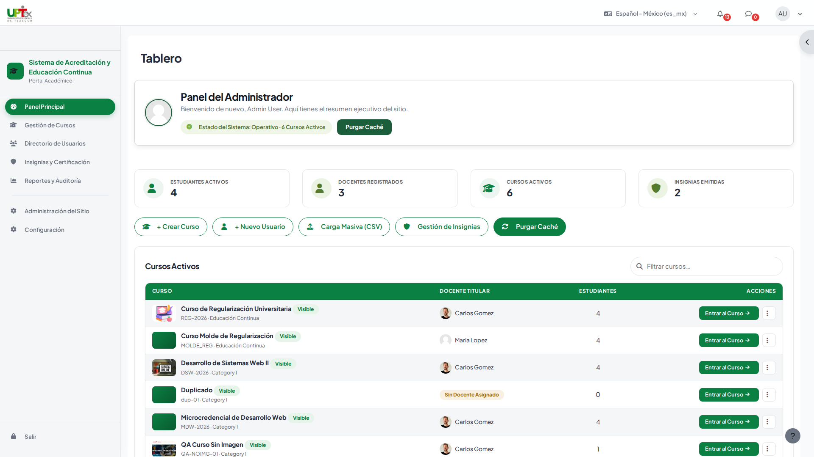

**Elementos de la pantalla:**

| Zona | Contenido |
|---|---|
| Encabezado (Hero) | Estado del sistema ("Operativo") con el número de cursos activos, y el botón **Purgar Caché**. |
| Indicadores globales | **Estudiantes Activos**, **Docentes Registrados**, **Cursos Activos**, **Insignias Emitidas**. |
| Accesos rápidos | **+ Crear Curso**, **+ Nuevo Usuario**, **Carga Masiva (CSV)**, **Gestión de Insignias**, **Purgar Caché**. |
| Tabla "Cursos Activos" | Hasta 10 cursos recientes, con miniatura, docente titular, número de alumnos, botón **Entrar al Curso** y menú de tres puntos (**⋮**). |
| Tabla "Directorio de Usuarios" | Hasta 10 usuarios recientes, con rol, estado y enlaces **Editar** / **Roles**. |

**¿Qué hace "Purgar Caché" y cuándo debo usarlo?**

Moodle guarda copias temporales (caché) de páginas y estilos para responder más rápido. Si después de un cambio de configuración o una actualización del sitio algo se ve "raro" o desactualizado, purgar la caché fuerza a Moodle a regenerar todo desde cero.

1. Presione **Purgar Caché** (en el encabezado o en los accesos rápidos).
2. El botón se deshabilita brevemente mientras se procesa.
3. Aparecerá un aviso emergente confirmando el resultado — no es necesario recargar la página manualmente.

**Pasos para usar el menú de acciones (⋮) de un curso:**

1. En la tabla "Cursos Activos", localice el curso deseado.
2. Presione el ícono **⋮** al final de su fila.
3. Elija entre **Configurar Curso**, **Participantes**, **Calificador** o **Control de Asistencia** (esta última solo si el curso tiene esa actividad instalada).
4. Para cerrar el menú sin elegir nada, presione en cualquier otra parte de la pantalla o la tecla `Escape`.

---

### 4.2 Catálogo Global de Cursos

**Ruta:** `/my/courses.php`

**Para qué sirve:** a diferencia de la tabla resumen del Panel Principal (máximo 10 filas), esta pantalla muestra **absolutamente todos** los cursos del sistema, incluidos los ocultos — es la herramienta de auditoría completa.

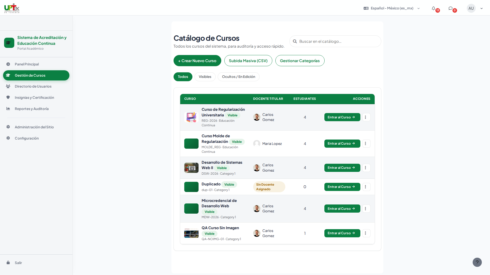

**Elementos de la pantalla:**

| Elemento | Descripción |
|---|---|
| Accesos rápidos | **+ Crear Nuevo Curso**, **Subida Masiva (CSV)**, **Gestionar Categorías**. |
| Pestañas de estado | **Todos**, **Visibles**, **Ocultos / En Edición**. |
| Tabla completa | Igual que la del Panel Principal, con dos acciones adicionales en el menú **⋮**: **Duplicar** y **Respaldar (.mbz)**. |

**Pasos para encontrar un curso oculto:**

1. Presione la pestaña **Ocultos / En Edición**.
2. Si conoce parte del nombre, escríbalo en el buscador para reducir la lista.
3. Use el menú **⋮** de ese curso para configurarlo o hacerlo visible nuevamente desde **Configurar Curso**.

**Pasos para duplicar o respaldar un curso:**

1. Localice el curso y abra su menú **⋮**.
2. Elija **Duplicar** (crea una copia completa como plantilla nueva) o **Respaldar (.mbz)** (genera un archivo de respaldo descargable).
3. Siga el asistente nativo de Moodle que se abre — ambos procesos requieren confirmar varias pantallas antes de completarse.

---

### 4.3 Directorio de Usuarios

**Ruta:** `/admin/user.php`

**Para qué sirve:** listado completo de todas las cuentas del sistema, con búsqueda avanzada, edición de perfiles y asignación de roles.

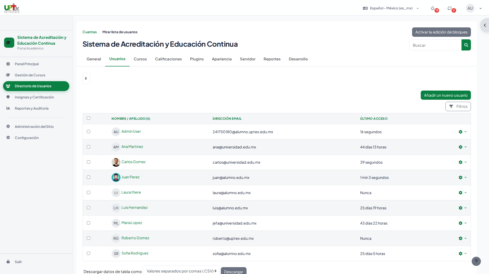

> Esta pantalla es una herramienta **núcleo de Moodle** — SAEC no la reemplaza con una versión propia, solo hereda el mismo estilo visual del resto del sitio (tipografía, bordes, colores). Su comportamiento (filtros, edición, asignación de roles) es el estándar de la plataforma Moodle.

**Pasos para editar un usuario:**

1. Localice al usuario en la tabla, o utilice los filtros de búsqueda avanzada en la parte superior.
2. Presione sobre su nombre o el ícono de edición correspondiente.
3. Modifique los campos necesarios en el formulario nativo de Moodle y guarde.

**Pasos para asignar un rol:**

1. Localice al usuario y abra la opción de roles en su fila.
2. Elija el contexto (sitio completo o un curso específico) y el rol a asignar.
3. Confirme la asignación.

---

### 4.4 Reportes y Auditoría

**Ruta:** `/report/log/index.php`

**Para qué sirve:** monitorear la salud y actividad del sistema en tiempo real, y exportar la bitácora completa de eventos para revisión externa.

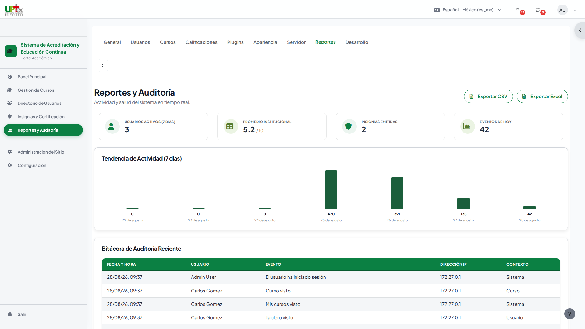

**Elementos de la pantalla:**

| Elemento | Descripción |
|---|---|
| Botones de exportación | **Exportar CSV** y **Exportar Excel**. |
| Indicadores | **Usuarios Activos (7 días)**, **Promedio Institucional**, **Insignias Emitidas**, **Eventos de Hoy**. |
| Gráfica de tendencia | Actividad diaria de los últimos 7 días. |
| Bitácora de Auditoría Reciente | Últimos 15 eventos registrados: fecha y hora, usuario, evento, dirección IP y contexto. |

**Cómo leer la columna "Usuario" de la bitácora:**

| Valor mostrado | Significa |
|---|---|
| Nombre real de una persona | El evento fue realizado por esa cuenta. |
| **Sistema** | El evento fue generado automáticamente (tareas programadas, procesos internos), sin un usuario humano detrás. |
| **Anónimo** | Moodle marcó el evento como anónimo por política de privacidad — no se puede vincular a una persona específica. |

**Pasos para exportar la bitácora completa:**

1. Presione **Exportar CSV** (compatible con Excel, incluye acentos correctamente) o **Exportar Excel**.
2. La descarga comienza de inmediato — no es necesario confirmar ninguna ventana adicional.
3. El archivo generado se llama `saec_auditoria_{fecha}.csv` o `.xls`, con hasta 500 de los eventos más recientes.

---

### 4.5 Centro de Administración del Sitio

**Ruta:** `/theme/saec/pages/admin_hub.php`

**Para qué sirve:** es el índice curado de toda la configuración avanzada de Moodle — separado deliberadamente del Panel Principal para que este último se mantenga enfocado en la operación del día a día.

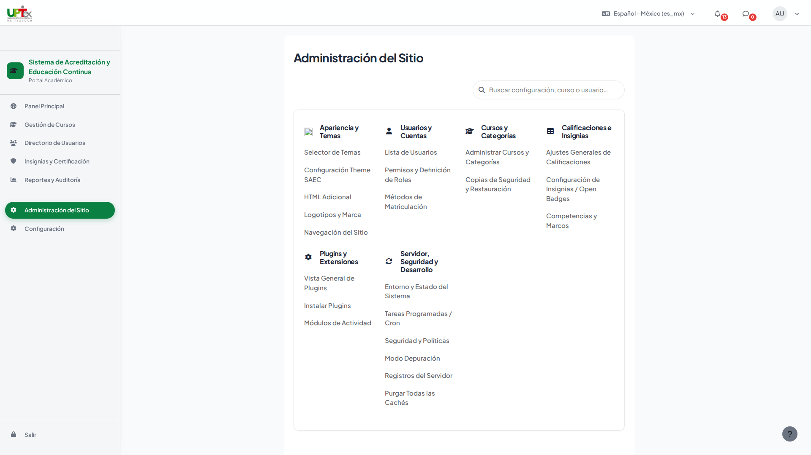

**Categorías disponibles:**

| Categoría | Ejemplos de configuración |
|---|---|
| **Apariencia y Temas** | Selector de temas, configuración visual, logotipos. |
| **Usuarios** | Listado de usuarios, roles, métodos de inscripción. |
| **Cursos** | Gestión de cursos, configuración de respaldos. |
| **Calificaciones** | Configuración de calificaciones e insignias, competencias. |
| **Plugins** | Resumen e instalación de plugins, módulos de actividad. |
| **Servidor** | Entorno técnico, tareas programadas, seguridad, bitácoras, purga de cachés. |

**Pasos para encontrar una configuración específica:**

1. Escriba una palabra clave en el buscador (por ejemplo, "roles" o "temas").
2. La lista se filtra en tiempo real, ocultando las tarjetas sin coincidencias.
3. Presione el enlace deseado — lo llevará directamente a la pantalla de configuración nativa de Moodle correspondiente.

> Si no encuentra ningún resultado, verifique la ortografía o explore visualmente las 6 categorías — algunas configuraciones avanzadas usan terminología técnica de Moodle que puede diferir del término que usted esperaría.

---

### 4.6 Preferencias de Cuenta

**Ruta:** `/user/preferences.php`

**Para qué sirve:** igual que en los otros roles (ver [2.6](#26-preferencias-de-cuenta)), pero con opciones adicionales visibles según los permisos de Administrador.

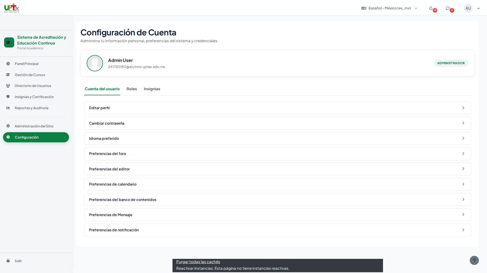

**Pasos:**

1. Entre desde el menú de su usuario en la esquina superior derecha.
2. Navegue por las pestañas de categoría.
3. Presione el enlace del formulario que necesita modificar y guarde los cambios ahí.

---

## Capítulo 5 — Glosario y Preguntas Frecuentes

### Glosario

| Término | Definición |
|---|---|
| **SAEC** | Sistema de Acreditación y Educación Continua — el nombre de esta plataforma institucional. |
| **UPTex** | Universidad Politécnica de Texcoco, la institución propietaria de SAEC. |
| **Insignia (Badge)** | Credencial digital verificable que certifica una habilidad, curso o logro. |
| **Hash de verificación** | Código único e irrepetible que identifica una insignia específica, usado para confirmar su autenticidad públicamente. |
| **Docente titular** | El profesor principal asignado a un curso — se muestra en las tablas de cursos del Administrador. |
| **Estatus "En Riesgo"** | Clasificación automática de un alumno cuya calificación es menor a 7.0 o cuya asistencia es menor al 80%. |
| **Estatus "Acreditado"** | Alumno sin riesgo académico y con calificación de 8.0 o superior. |
| **Purgar Caché** | Acción administrativa que fuerza a Moodle a regenerar todas sus copias temporales de páginas y estilos. |
| **Autoinscripción** | Mecanismo que permite a un alumno inscribirse a sí mismo en un curso marcado como disponible, sin intervención de un administrador. |
| **Bitácora de auditoría** | Registro cronológico de eventos del sistema (inicios de sesión, cambios, accesos) usado para trazabilidad y seguridad. |

### Preguntas Frecuentes

**¿Olvidé mi contraseña, ¿puedo recuperarla yo mismo?**
No. SAEC no envía correos automáticos de restablecimiento. Debe seguir el procedimiento de la sección [1.3](#13-recuperación-de-contraseña) y contactar al área institucional correspondiente a su perfil.

**Soy Alumno y también doy clases de capacitación a otros compañeros. ¿Por qué no veo el Panel del Docente?**
El Panel Principal que usted ve depende de si el sistema lo identifica con permisos de gestión de curso (`moodle/course:update`) en al menos un curso. Si cree que debería tener el rol de Docente, contacte al Administrador del Sistema para que revise su asignación de rol.

**Como Administrador, no veo la pantalla "Estudiantes y Progreso" — ¿es un error?**
No necesariamente. Esa pantalla solo se activa para cuentas inscritas como profesor con permisos de gestión en al menos un curso. Un Administrador típico, sin inscripción docente en ningún curso, verá en su lugar el reporte nativo de Moodle sin el diseño personalizado de SAEC.

**¿Por qué el botón "Validar Certificado" de la portada me lleva al login?**
Es un comportamiento conocido de esta versión de la plataforma: ese botón específico de la portada pública enlaza al inicio de sesión, no a una herramienta de validación independiente. Para verificar una insignia real, use el enlace **"Verificar insignia"** dentro del detalle de cada credencial (sección [2.5](#25-mi-mochila-de-insignias)), que sí es una página pública de verificación.

**¿Qué diferencia hay entre "Mis Cursos" y el Catálogo Global de Cursos del Administrador?**
"Mis Cursos" (Alumno o Docente) muestra únicamente los cursos donde esa persona está inscrita. El Catálogo Global (solo Administrador) muestra **todos** los cursos del sistema completo, incluidos los que están ocultos a los alumnos.

**Tomé asistencia pero marqué las opciones y no se guardó nada — ¿qué pasó?**
Marcar P/L/E/A en la pantalla de toma de asistencia no guarda automáticamente. Debe presionar el botón de envío al final del formulario para que los cambios se registren.

**¿Puedo deshacer la purga de caché si algo sale mal?**
Purgar la caché es una operación segura y reversible en el sentido de que no borra información real (calificaciones, usuarios, cursos) — solo copias temporales que Moodle vuelve a generar automáticamente. No existe un escenario de pérdida de datos por esta acción.

---

*Manual generado a partir de la Especificación Funcional SAEC — capturas de pantalla auténticas tomadas directamente de la plataforma en operación, correspondientes a los usuarios de referencia `alumno_top1`, `maestro_b1` y `admin`.*
